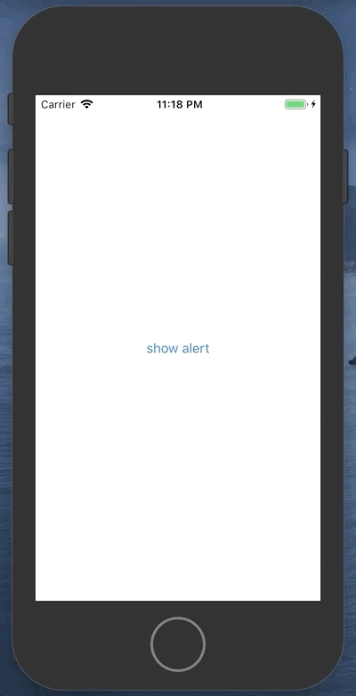
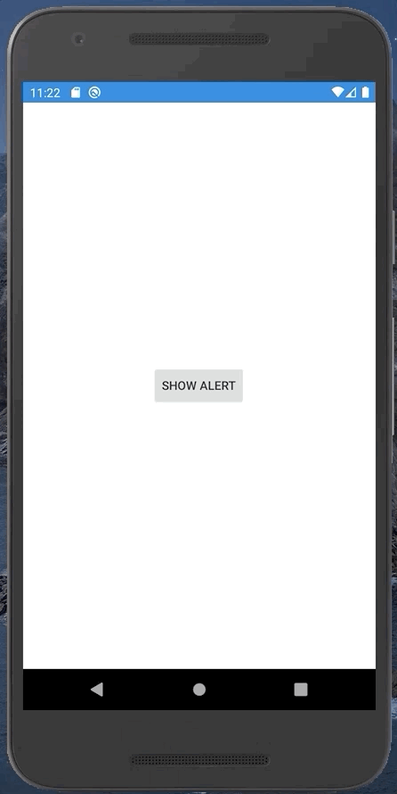

# Three button alert for Xamarin.Forms (Android and iOS)

Xamarin.Forms [DisplayAlert](https://docs.microsoft.com/en-us/xamarin/xamarin-forms/user-interface/pop-ups) method allows only setting two buttons for platform specific alert. This repository shows how to implement alert for Xamarin.Forms that will display three buttons.

Blog post: https://programistologia.pl/2020/08/02/en-displaying-three-button-alert-in-xamarin-forms/

## iOS

## Android

